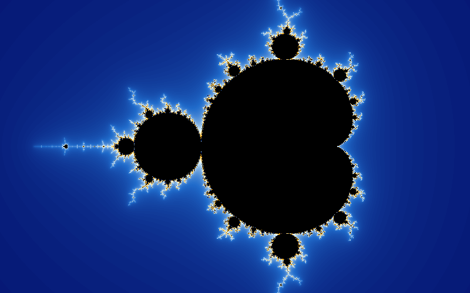
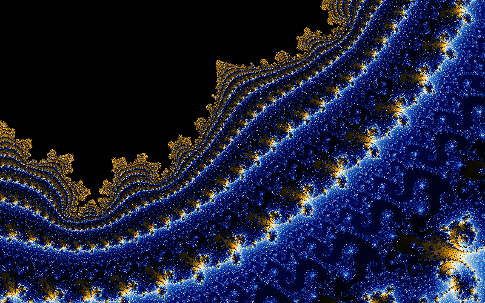
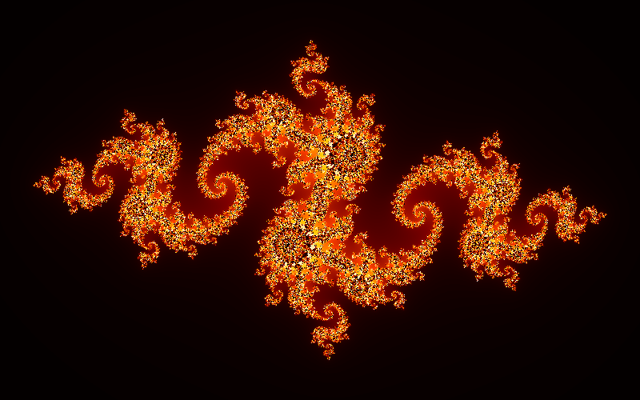
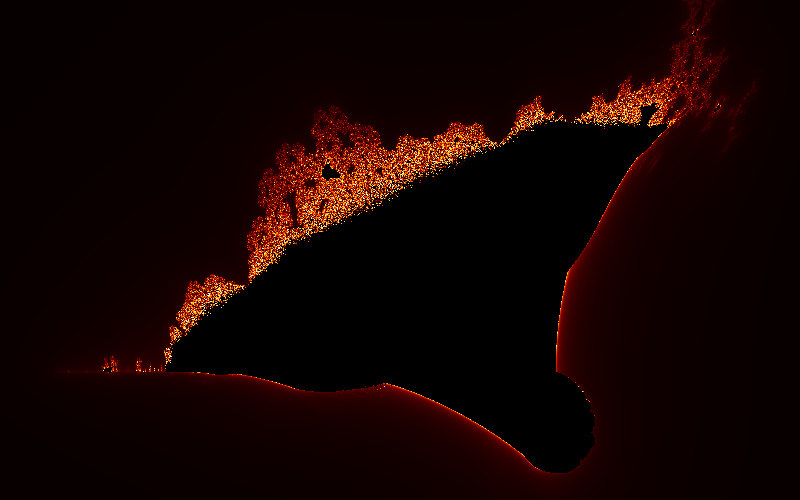
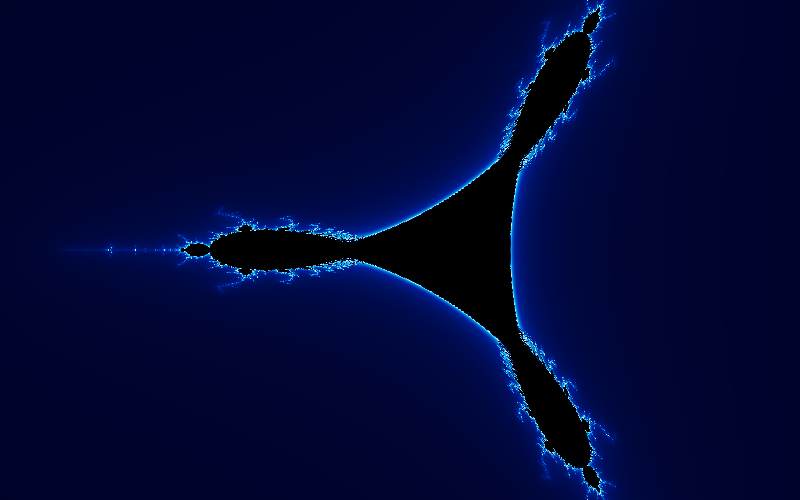
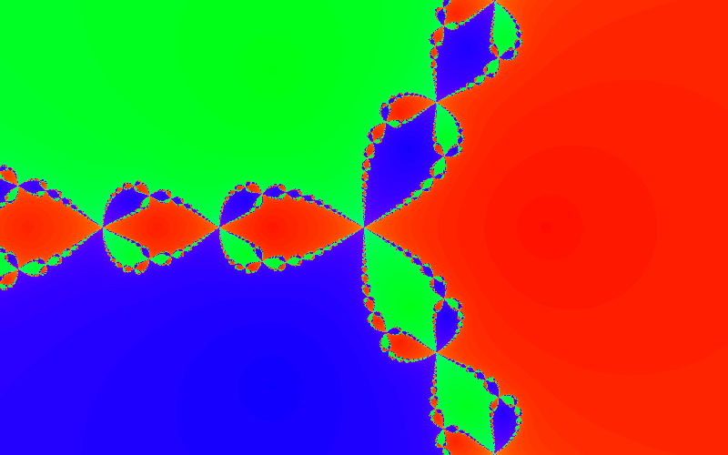

# gofract

A cross-platform fractal viewer in the spirit of the classic Fractint,
written in Go on [Ebitengine](https://ebitengine.org).

Hotkey driven, GPU shader rendering for shallow zooms with an automatic
hand-off to a progressive CPU renderer when float32 runs out, perturbation
deep zoom past float64 limits, palette cycling,
rubber-band zoom box, Fractint `.map` palettes. Families: Mandelbrot, Burning
Ship, Tricorn, Multibrot (z^3), Newton (z^3 - 1), each escape-time family
with its Julia variant.

## Screenshots

Every image below was rendered headlessly with `-shot`, and the sidecar next
to each one in `docs/screenshots/` reopens the exact view with `-load`.

| | |
|---|---|
|  |  |
| Seahorse valley, view width 1e-15, perturbation rendering with 20,000 iterations | Julia set for c = -0.8 + 0.156i in the fire palette |
|  |  |
| Burning Ship | Douady rabbit, Julia set for c = -0.123 + 0.745i |
|  |  |
| Tricorn | Newton's method on z^3 - 1, coloured by root |

Reproduce any of them, for example:

    gofract -load docs/screenshots/seahorse-deep.json

## Install

Every [GitHub release](https://github.com/richardwooding/gofract/releases)
carries prebuilt packages for Linux (amd64, arm64), macOS (universal) and
Windows (amd64, arm64):

| File | Install |
|---|---|
| `gofract_<ver>_linux_<arch>.tar.gz` | unpack and run `gofract` |
| `gofract_<ver>_linux_<arch>.deb` | `sudo apt install ./gofract_<ver>_linux_<arch>.deb` |
| `gofract_<ver>_linux_<arch>.rpm` | `sudo dnf install ./gofract_<ver>_linux_<arch>.rpm` |
| `gofract_<ver>_<arch>.flatpak` | `flatpak install gofract_<ver>_<arch>.flatpak` (needs the Flathub remote for the runtime) |
| `gofract_<ver>_<arch>.snap` | `sudo snap install --dangerous gofract_<ver>_<arch>.snap` |
| `gofract_<ver>_darwin_universal.tar.gz` | unpack and run; allow the unsigned binary under Privacy & Security on first launch |
| `gofract_<ver>_windows_<arch>.zip` | unpack and run `gofract.exe` |

The deb, rpm, Flatpak and Snap packages add a desktop entry and icon. The
Flatpak and Snap are not yet published to Flathub or the Snap Store, so they
install as sideloaded bundles; `--dangerous` tells snapd the file is unsigned.
Packaging sources live in `packaging/` and `snap/`.

To cut a release, push a tag: `git tag v0.2.0 && git push origin v0.2.0`. The
release workflow builds every platform and attaches the archives with a
checksum file.

## Build from source

Requires Go 1.27 and, on Linux and macOS, a C compiler because Ebitengine
uses cgo there. Windows needs no C toolchain.

Linux (Fedora):

    sudo dnf install gcc pkg-config mesa-libGL-devel mesa-libGLES-devel \
        libX11-devel libXcursor-devel libXi-devel libXinerama-devel \
        libXrandr-devel libXxf86vm-devel libxkbcommon-devel wayland-devel \
        alsa-lib-devel

Linux (Debian/Ubuntu):

    sudo apt install gcc pkg-config libgl1-mesa-dev libgles2-mesa-dev \
        libx11-dev libxcursor-dev libxi-dev libxinerama-dev libxrandr-dev \
        libxxf86vm-dev libxkbcommon-dev libwayland-dev libasound2-dev

macOS: `xcode-select --install`.

Then:

    go build -o gofract ./cmd/gofract
    ./gofract

On an immutable Fedora host (Silverblue, Bluefin) build inside a distrobox:

    distrobox create -n gofract -i registry.fedoraproject.org/fedora-toolbox:44
    distrobox enter gofract -- sudo dnf install -y golang <packages above>
    distrobox enter gofract -- go build -o gofract ./cmd/gofract

The binary runs on the host.

## Use

    gofract [-width 1024] [-height 768] [-type burningship] [-iter 1024]
            [-palette fire] [-gpu auto|off|on] [-shot frame.png] [-list]
            [-map palette.map] [-load view.json] [-out dir] [-workers n]

Press `F1` in the viewer for the full key list. The essentials:

| Input | Action |
|---|---|
| drag left mouse | zoom box, release to zoom in |
| right click / wheel | zoom out / in about the cursor |
| arrows, PgUp, PgDn, Home | pan, zoom, reset |
| Backspace | undo the last view change |
| Space | toggle Julia mode with c at the cursor point |
| `[` `]` | halve / double colour density |
| T | choose the fractal type |
| `,` `.` | halve / double max iterations |
| C, `-`, `=` | toggle palette cycling, slower, faster |
| P | next palette |
| G | GPU shader: auto, off, on |
| L | load a `.map` from `./maps` or `$XDG_CONFIG_HOME/gofract/maps` |
| S | save PNG and a JSON sidecar reopenable with `-load` |
| Esc | quit |

`-shot file.png` renders one frame and exits, handy for scripting or for
comparing the GPU and CPU paths.

## Deep zoom

The view centre is stored as decimal text at whatever precision the zoom
needs, so panning and zooming never lose digits. Below a view width of 1e-8
the escape-time families (Mandelbrot, Burning Ship, Tricorn, Multibrot, and
their Julia sets) switch to perturbation rendering: a reference orbit at the
centre in arbitrary precision, each pixel iterating its float64 offset from
it with a family-specific recurrence, and rebasing onto the critical orbit
when a pixel drifts from the reference. Deep views need many more
iterations; press `.` until the detail resolves. Newton falls back to plain
float64 and pixelates past that depth, and the status line says so.

## Layout

    cmd/gofract        entry point and flags
    tools/mkicon       renders the application icon into assets/
    assets/            icon, desktop entry and AppStream metainfo
    packaging/         nfpm (deb/rpm) config and Flatpak manifest
    snap/              snapcraft.yaml; packaging/test-snap.sh installs and launches the built snap in CI
    internal/fractal   Params (view maths) and the escape-time kernels
    internal/render    progressive tiled renderer on a goroutine pool
    internal/palette   256-colour palettes, presets, .map load/save
    internal/ui        Ebitengine game loop, input, overlays, saving,
                       and the Kage shader (fractal.kage)

## Tests

    go test ./...
    go test -bench . -run xxx ./internal/render/

## License

MIT, see [LICENSE](LICENSE).
